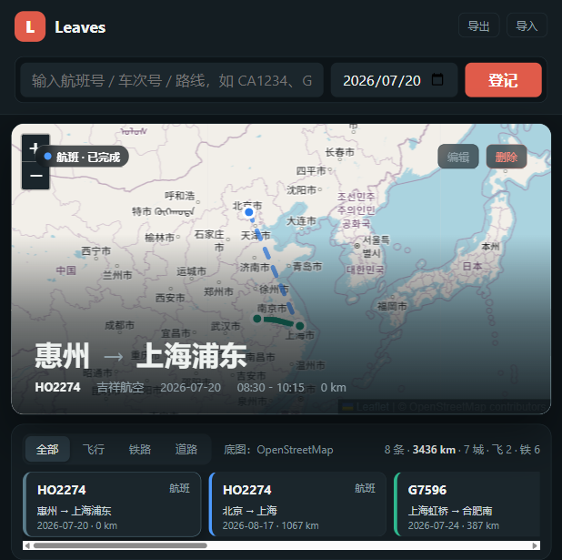
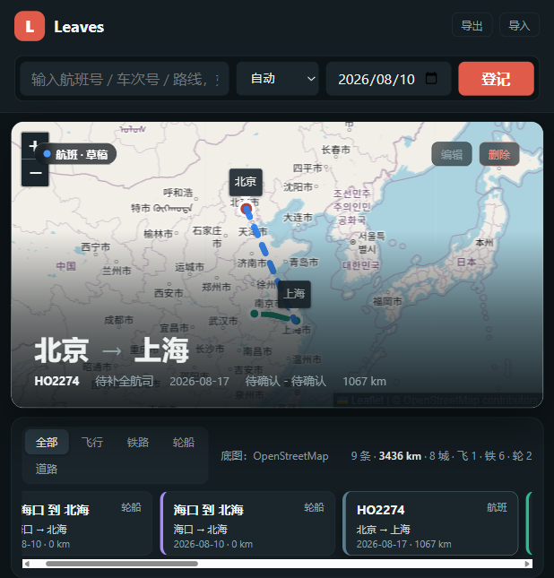

# Leaves

Leaves 是一个 Windows 优先的个人出行记录软件。它关注的是“把一次移动轻松记下来”，而不是替代航班雷达、铁路调度或订票工具。当前可运行版本是 `apps/desktop-prototype/` 中的 Node + 原生 HTML/CSS/JS 桌面原型，后续目标是 Tauri + React + SQLite 桌面应用。

## 当前状态

> 已实现内容均在桌面原型中落地；SQLite 与 Tauri 仍在规划阶段。

- 快速登记：输入航班号、铁路车次号或路线，自动识别交通方式并生成行程草稿。
- 单屏回看：首页聚焦顶栏快速登记、地图 Hero 和底部近期行程条。
- 地图轨迹：基于 Leaflet 展示航线弧线、铁路/道路/轮船近似路线和城市点位。
- 账号隔离：进入应用前先登录或注册，不同账号看到各自的行程数据。
- 本地持久化：行程写入当前账号的 localStorage，并同步到本地服务文件。
- 行程管理：支持新增、编辑、删除、JSON 导入导出，以及 12306 积分明细 CSV 导入铁路行程。
- 铁路辅助：车站搜索、车次号转换、经停站查询和中转换乘通过本地 12306 代理完成。
- 手动兜底：航班登记保持手动填写；铁路查询失败时可直接保存手动记录；离线时仍可记录行程。
- 数据看板：提供里程、城市、交通方式和近期动态等统计视图。
- 成就系统：根据行程数量、方式、城市和里程解锁成就。

## 功能截图

首页采用深色单屏布局，当前行程在地图上直接呈现，底部行程条用于快速切换记录。



多交通方式记录可以在同一条近期行程栏中筛选与回看。



## 快速开始

前置要求：Node.js 16+。

在项目根目录执行：

```powershell
npm install
npm start
```

启动后访问：

```text
http://127.0.0.1:4173
```

自定义端口：

```powershell
$env:LEAVES_PORT=8080; npm start
```

常用环境变量：

| 变量 | 说明 |
| --- | --- |
| `LEAVES_PORT` | 本地服务端口，默认 `4173` |
| `LEAVES_HOST` | 绑定地址，默认适合本机访问 |
| `LEAVES_DATA_DIR` | 本地持久化数据目录 |
| `LEAVES_MAX_USERS` | 账号数量上限，默认 `5` |
| `LEAVES_SESSION_DAYS` | Session cookie 有效天数 |
| `LEAVES_READ_ONLY` | 设为 `1` 时启用只读演示模式 |

账号登录、行程持久化和 12306 查询都依赖本地服务。直接打开 `apps/desktop-prototype/index.html` 只适合静态资源调试，无法完成完整登录流程。

## 原型结构

```text
apps/desktop-prototype/
  index.html              应用壳、登录入口、主视图和隐藏文件选择控件
  styles.css              深色单屏视觉、响应式布局和组件状态
  app.js                  客户端状态、行程 CRUD、地图、铁路和航班流程
  dev-server.js           静态服务、认证接口、行程数据接口和 12306 代理路由
  server/
    auth-service.js       账号、密码哈希、session 与账号上限
    ticket-service.js     12306 车站、车次、经停站、换乘和时间查询
  vendor/                 离线 Leaflet、地图边界等浏览器资产
```

更多文档：

- [产品需求文档](docs/PRD.md)
- [技术架构](docs/TECHNICAL_ARCHITECTURE.md)
- [数据模型](docs/DATA_MODEL.md)
- [开发路线图](docs/ROADMAP.md)
- [服务器部署与域名绑定可行性报告](docs/DEPLOYMENT_FEASIBILITY.md)
- [服务器部署手册](docs/DEPLOYMENT.md)
- [账号与轻量数据库方案](docs/AUTH_SQLITE_PLAN.md)
- [12306 车票积分提取 Skill](.codex/skills/12306-ticket-points-extractor/SKILL.md)

## 数据导入导出

- `导出`：下载 Leaves JSON 文件，包含当前账号全部行程。
- `导入JSON`：导入 Leaves 导出的 JSON，并覆盖当前账号本地行程。
- `导入CSV`：导入 12306 积分明细提取出的 CSV，按订单号/车次/日期去重后追加铁路行程，不覆盖已有记录。

CSV 推荐字段见 [.codex/skills/12306-ticket-points-extractor/SKILL.md](.codex/skills/12306-ticket-points-extractor/SKILL.md)。

## 12306 铁路能力

本地服务将铁路查询能力封装为同源 API，前端不直接跨域访问 12306：

| 接口 | 方法 | 能力 |
| --- | --- | --- |
| `/api/12306/search-stations` | GET | 车站搜索，支持中文、拼音、简拼和三字码 |
| `/api/12306/query-transfer` | POST | 中转换乘方案 |
| `/api/12306/train-route` | POST | 经停站与时刻表 |
| `/api/12306/train-no` | POST | 车次号转官方唯一编号 |
| `/api/12306/current-time` | GET | 当前时间 |

登记日期和查询日期是分开的：登记日期保存真实出行日，可以是历史日期；12306 查询日期仅用于接口调用，按当前可查范围处理。接口不可用时，应用会保留手动登记流程。

## 离线策略

核心浏览器资产保存在 `apps/desktop-prototype/vendor/`，不依赖 CDN。联网时优先加载在线地图瓦片；瓦片失败时自动切换备用源，并保留本地省级边界底图用于基础回看。

在地址后添加 `#offline` 可模拟离线底图：

```text
http://127.0.0.1:4173/#offline
```

## 后续方向

- 将原型迁移到 Tauri 2 + React + TypeScript。
- 用 SQLite 替代当前文件持久化，并保留每账号数据隔离。
- 把铁路、地图和手动登记能力整理为 provider adapter。
- 继续打磨移动窄屏的一屏体验，重点验证 360-430 px 宽度和 640-740 px 高度。
