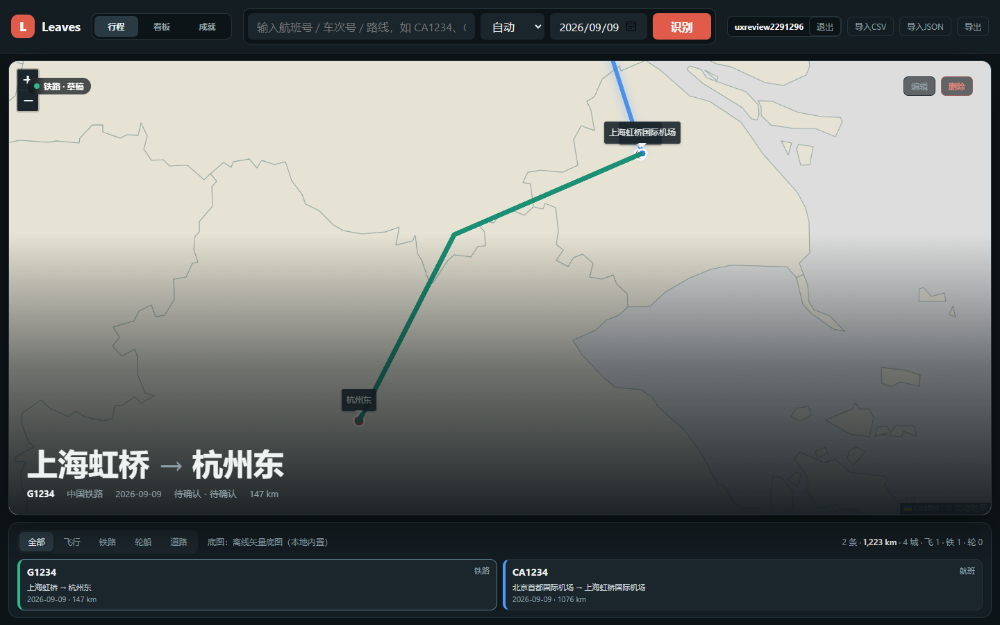
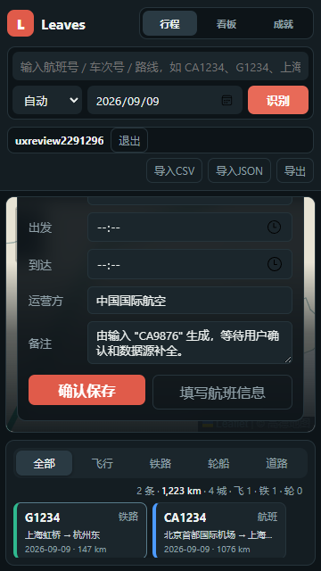
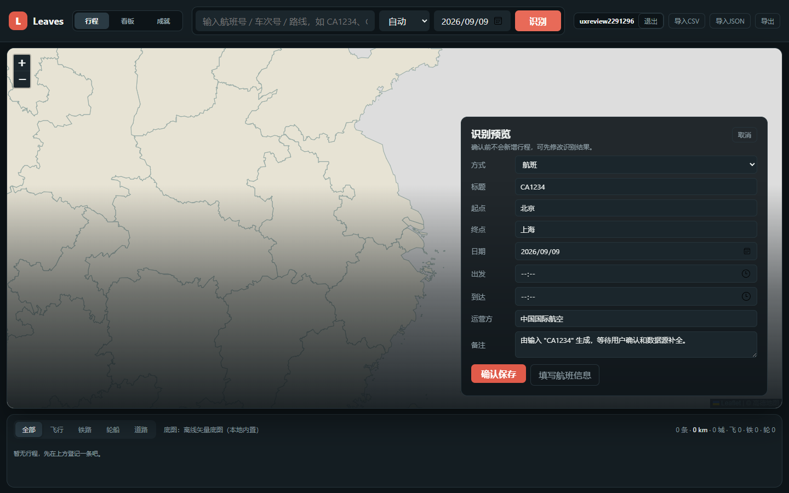
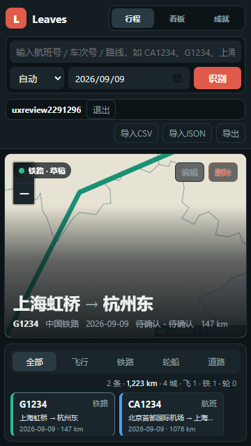
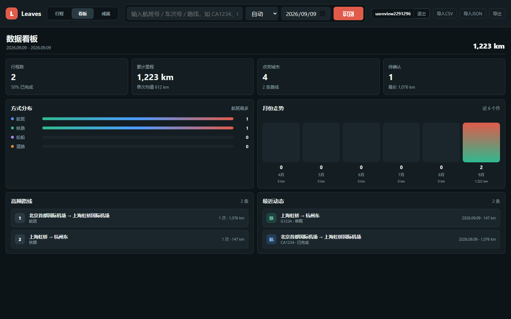

# Leaves 当前交互界面分析报告

评审日期：2026-09-09  
评审对象：`apps/desktop-prototype/`，版本 `0.2.0`，Git 基线 `1e161ba`  
交付内容：现状分析、问题证据、优化方向、实施顺序及验收建议。

## 1. 核心判断

Leaves 已经具备清楚的产品骨架：快速登记、地图展示、近期行程，以及看板和成就。暗色界面、交通方式颜色和地图路线具有一致的辨识度，适合继续演进。

当前最需要解决的是 **记录是否可信、录入能否完成、操作结果是否符合预期**。单纯调整配色、圆角或增加动画，无法解决这些问题。

本轮确认的主要问题：

1. **服务端保存失败没有提示，刷新后新记录消失。** 这是最优先的可靠性问题。
2. **小屏新增表单被裁切。** 360×640 下，起终点、标题和取消等上半部分内容不可正常看到。
3. **没有提供路线的航班被默认填成北京→上海。** “识别预览”容易使用户把默认值理解成真实识别结果。
4. **切换页面会丢失尚未同步到草稿的输入，“跳过”会直接取消新增。** 缺少连续、可恢复的编辑过程。
5. **状态、地图和统计的含义不够准确。** 填了时间即“已完成”，站点名称直接当城市计数，估算里程直接展示为 km。

建议先修复上述问题，再压缩首屏次要操作、合并录入步骤，最后改善历史检索、看板与成就体验。

## 2. 评审方式与边界

本报告结合源码审查、浏览器操作、截图和 DOM 尺寸测量；涉及用户理解成本的判断属于启发式评估，尚未通过真实用户访谈或任务成功率实验验证。

| 项目 | 本次执行情况 |
|---|---|
| 本地运行 | 使用 `npm start`，独立端口 `4187`；使用临时数据目录与测试账号 |
| 登录与注册 | 确认未登录时主应用隐藏；通过注册进入应用 |
| 新增操作 | 完成一条手动航班记录、一条铁路查询失败后的手动记录 |
| 异常场景 | 模拟铁路接口查询失败；模拟行程保存接口返回 HTTP 500 |
| 交互操作 | 交通筛选、预览修改、切换页面、航班面板跳过、刷新后的数据恢复 |
| 视口 | 桌面 1440×900、1366×768；中等宽度 1080×740；手机尺寸 360×640、390×740、430×740 |
| 地图环境 | 浏览器阻断第三方请求，保留本地服务，验证内置离线底图；截图不是在线瓦片效果 |
| 尚未覆盖 | 真机软键盘、iOS/Safari、读屏器、数百条真实记录、实际 12306 查询成功率、导入文件的完整往返操作 |

未读取个人行程文件，未修改应用源码。截图中账号和行程均为测试数据。铁路失败场景由浏览器注入，不能据此推断真实接口当前不可用。桌面浏览器的手机尺寸测试也不能代替真机测试。

原始测量与复现结果见 [observations.json](images/ux-review-20260909/observations.json)。

## 3. 应继续保留的设计

- **地图作为首页主体。** 它能直观表达“去过哪里”，也符合旅行记录产品的用途。
- **登记入口始终容易找到。** 顶部输入、交通方式、日期能承接轻量录入；需要精简的是周围竞争信息及后续步骤。
- **确认前不新增记录。** 预览明确说明这一点，基本方向正确。
- **铁路查询有手动兜底。** 外部查询失败后依然能够保存历史行程。
- **航班支持机场输入联想。** 手动录入方向明确，应在现有模式上减少重复填写。
- **已有账号隔离、当前卡片选中状态和离线底图。** 这些基础应在后续调整中保持。

桌面首页实际截图：

## 4. 问题清单与优先级

P0：影响记录保存与恢复，应首先处理。P1：阻碍主要操作或可能产生错误记录，应在下一轮交互改造中完成。P2：降低效率、可理解性或可操作性。P3：体验完善项。

| 编号 | 优先级 | 问题 | 证据类型 | 优化方向 |
|---|---|---|---|---|
| U01 | P0 | 保存失败静默，刷新后新记录消失 | 浏览器复现＋源码 | 明确保存状态，保留待同步记录，避免旧数据覆盖 |
| U02 | P1 | 小屏表单被裁切，操作区域不足 | 截图＋尺寸＋点击失败 | 浏览与编辑使用不同容器，表单可滚动 |
| U03 | P1 | 航班等缺少路线时填入具体默认路线 | 浏览器观察＋源码 | 未知字段留空，区分输入、历史复用和估算来源 |
| U04 | P1 | 页面切换丢输入，“跳过”丢弃新增 | 浏览器复现＋源码 | 统一草稿状态，返回时保留，明确取消语义 |
| U05 | P1 | 信息完整程度与行程完成状态混用 | 保存结果＋源码 | 分离“是否发生”和“资料是否完整” |
| U06 | P1 | 空筛选下列表与当前行程矛盾 | 浏览器复现＋源码 | 列表、地图、详情保持相同筛选范围 |
| U07 | P2 | 手机顶栏占用过多，多个小按钮常驻 | 截图＋尺寸 | 收拢账号与导入导出，释放地图空间 |
| U08 | P2 | 通用预览与专用表单重复 | 实际录入＋源码 | 按交通方式直接进入必要字段表单 |
| U09 | P2 | 地图线条含义、控件位置不清楚 | 截图＋源码 | 标明路线示意，避让地图控件，突出当前行程 |
| U10 | P1 | 城市与里程统计口径容易误导 | 测试数据＋源码 | 城市归一化，区分估算与实际，解释图表指标 |
| U11 | P2 | 历史检索和导入语义不足 | 界面＋源码；规模影响为推断 | 保留近期条，增加全部记录入口和导入预览 |
| U12 | P2 | 初次使用、焦点和反馈引导不足 | 界面＋源码 | 可操作空状态、字段错误提示、键盘与触控优化 |

### U01：保存失败后，界面给出的结果不可靠

**复现：** 将行程保存请求 `PUT /api/data/trips` 模拟为 HTTP 500，新增 `G9999` 并确认保存。列表从 2 条变成 3 条，没有保存失败提示；刷新后，服务器返回原有 2 条，新记录消失。

**原因：** `persistTripsToServer()` 仅对 401 做处理，其他错误及网络异常静默；`syncTripsFromServer()` 又直接用服务端数组覆盖当前记录并写回浏览器缓存。

**用户影响：** 用户看到新卡片，会自然认为已经保存成功。之后发现记录消失，会破坏对整个记录工具的信任。本次复现的是新记录丢失，不代表已证明所有历史记录都会丢失。

**建议：** 使用“保存中／已保存／仅保存在此设备，待同步／同步失败，可重试”状态；失败时保留本地修改及重试能力；刷新恢复时识别尚未同步的记录，不能无条件以旧服务端数据覆盖。提示应说明当前记录在哪里、用户接下来能做什么。

**验收：** 模拟 HTTP 500、网络中断并刷新，新增记录仍可恢复，错误可见，重试成功后状态一致。

### U02：一屏浏览布局被直接用于长表单

首页可以一屏浏览，但填写九个字段需要独立的空间与滚动规则。目前表单放在地图绝对定位覆盖层内、底部对齐，地图容器裁切溢出内容，预览表单自身没有滚动容器。

| 视口 | 顶栏高度 | 首页地图卡高度 | 新增表单高度 | 实际表现 |
|---|---:|---:|---:|---|
| 1440×900 | 77 px | 655 px | 约 510 px | 新增预览完整可见 |
| 1366×768 | 77 px | 523 px | 约 510 px | 加上覆盖层上下内边距后，顶部已超出地图卡 |
| 1080×740 | 161 px | 411 px | 约 510 px | 表单顶部被裁切；取消点击被顶栏拦截 |
| 360×640 | 214 px | 265 px | 约 498 px | 预览上半部分不可见 |
| 390×740 | 218 px | 347 px | 约 498 px | 预览上半部分仍被裁切 |
| 430×740 | 218 px | 347 px | 约 498 px | 加宽没有解决高度不足 |

测试视口均未检测到文档横向溢出，但这不等于表单可用。360×640 的预览顶端位于视口 y≈−26 px，地图卡从 y≈220 px 开始，裁切范围远超一个标题。

专用航班表单虽然限制了最大高度，但手机截图中大量空间被说明与航司、航班号、日期占据，起降地所在的下方滚动区十分狭小。

**建议：** 首页保留“紧凑录入＋地图＋短行程条”；进入编辑时，桌面使用有最大高度和内部滚动的侧面板，手机使用覆盖工作区的全高编辑面板。顶部保留返回与标题，底部保留保存，只有字段区滚动。不要通过继续缩小文字和按钮容纳完整表单。

**验收：** 上述视口均能从首字段到备注完整操作，取消和保存可达；补充真机软键盘弹出、200% 缩放与横屏验证。

### U03：“识别结果”包含未经确认的具体路线

新测试账号首次输入 `CA1234`，未填写任何地点，预览却显示“北京→上海”。源码 `inferRoute()` 对没有路线的航班直接返回这组城市，对道路方式返回“杭州→上海”。这属于默认值，不是接口识别结果。

预览里的“确认保存”允许用户直接接受这些值。用户只是想登记一个航班号，却可能生成不真实的路线与里程。另一个分支中，铁路的“待确认”是非空文本，也能通过必填校验保存。

**建议：** 未知地点保持为空；用明确的必填状态或“保存待补充记录”承接。字段若来自历史记录，标为“沿用上次”，允许一键清空。地点、时间和里程应分别保存来源信息，避免把推断值呈现成已确认事实。

**验收：** 新账号只输入任意合法航班号，不产生具体起降地；必要信息不足时，不能以正常完整行程保存。

### U04：草稿缺少连续性，返回动作缺少明确语义

**复现一：** 新增航班，在预览中把起点改为“广州白云”，切到看板再回行程，起点恢复为“北京”。字段内容只在部分动作触发时同步，页面重绘重建了表单。

**复现二：** 从预览进入航班登记，填写起飞地后点击“跳过”，新增面板关闭，列表仍为原有 2 条，顶部原始输入也已清空。“跳过”的结果实际是取消整个新增流程。

**建议：** 草稿应随着字段修改更新；“返回”保留当前内容，“取消新增”明确丢弃，“稍后补充”应保留一条可继续的草稿。只有真正丢弃编辑时才需要适度提醒或撤销，不应让每次页面切换都弹确认。

**验收：** 预览与专用表单往返、切换页面后字段保持；按钮文案与保存、保留、丢弃行为一一对应。

### U05：“填了时间”被等同于“已经出行”

通用预览和航班表单都使用“出发、到达时间是否填写”决定 `completed` 或 `draft`。过去真实发生的行程缺少时间会成为草稿；未来计划行程填好时间也可能被标为已完成。

这会进一步影响完成率、看板“待确认”和成就，造成用户对数字含义的误解。

**建议：** 分开表达“行程状态：计划／已完成”和“信息状态：完整／待补充”。根据登记日期提供合理默认，但允许用户确认。补录历史记录时，时间应可以缺省；时间缺省不应自动否定行程发生。

**验收：** 过去无时间的真实记录和未来已填时间的计划记录，均可得到正确状态；统计口径随之统一。

### U06：筛选结果与详情展示范围不一致

已有航班和铁路记录，点击“轮船”：近期条显示“暂无行程，先在上方登记一条吧”，主卡片仍显示铁路行程。地图按筛选清空路线，详情却回退到全量记录中的第一条。

**建议：** 选中行程必须属于当前筛选集。空结果显示“暂无轮船记录”，提供“查看全部”或“登记轮船”；区分账号本身没有记录与筛选没有命中。统计若保持全量，应明确标注“全部记录统计”。

**验收：** 任意交通方式筛选后，列表、路线、详情、计数的范围清楚且一致。

### U07：移动端顶部的次要操作挤占主要内容

360×640 下顶栏占 214 px，约为屏高的 33%；390×740 下占 218 px，约 29%。账号、退出和导入导出各占空间，首页地图卡只剩 265–347 px。看板页也保留完整录入区及管理操作，压低了指标的可见面积。

**建议：** 将账号、CSV 导入、JSON 恢复与导出收进“更多”入口；手机首页保留一个主输入区，方式与日期紧凑排列。看板和成就页的新增入口可收为按钮，按需展开。

目标可以设为：360×640 浏览态顶栏约 130–150 px、底部条约 110–130 px，让地图获得更大的剩余空间。这是设计目标，不是本次实测已实现的结果，具体值需结合触控与文本可读性验证。

### U08：快速录入后仍要理解两套表单

航班路径为“输入→识别预览→填写航班信息→保存”；预览已经展示方式、标题、起终点、日期、时间、运营方、备注共九项，专用面板又出现航司、航班号、日期和起降地。

通用预览的主按钮是“确认保存”，更完整的航班登记反而是次按钮。用户需要自己判断何时该直接保存、何时该再进入下一层。铁路手动兜底也要先进入查询流程。

**建议：** 输入后直接进入对应交通方式的统一登记面板。必要信息优先展示，时间、备注等收进“更多信息”；铁路站点查询作为可选辅助，手动录入始终直接可达。首按钮可用“继续登记”，按已选方式使用更具体的说明。

推荐流程：

| 方式 | 录入主路径 | 辅助动作 |
|---|---|---|
| 铁路 | 车次或路线＋乘车日期→确认区间→保存 | 查询经停站、选区间、手动填写 |
| 航班 | 航班号＋起飞日期→填写起降地→保存 | 机场联想、航司预填、沿用历史信息 |
| 道路／轮船 | 路线＋日期→确认→保存 | 时间、运营方和备注按需补充 |

沿用目前航班手动登记方向；铁路保持历史登记与人工兜底，不引入实时余票。

### U09：地图缺少“精确到什么程度”的说明

当前地图同时画出筛选下的多条行程，再聚焦选中行程。截图中其他航班线和机场标签会与当前铁路端点重叠。左上角状态徽标也占用了缩放控件区域，360 px 截图中加号被覆盖。

源码显示，缺少经停点的地面路线使用人为折线，航班／轮船使用弧线；这些具有示意用途，却没有面向用户的说明。

**建议：** 将选中路线与背景历史路线拉开视觉层级，只为当前行程优先显示端点标签；保留固定地图控件安全区；提供“定位当前行程／查看全部”。路线标注“路线示意”或“按经停站连线”，让用户知道线条代表什么。

本次验证的是离线底图表现；在线瓦片下的对比度、标签拥挤仍需单独检查。

### U10：统计展示精确，但统计口径并不精确

测试录入“北京首都机场→上海虹桥机场”和“上海虹桥→杭州东”两条记录，看板显示“点亮城市 4”。源码把原始起终点名称加入集合，因此机场和站点分别被计数；按这组测试数据的城市应为北京、上海、杭州，共 3 个。

此外，`estimateDistance()` 使用坐标间球面距离，首页与累计里程没有区分估算值和实际值；“月份走势”的柱高按里程绘制，突出数字却是行程条数，“近6个月”又以最新行程月份作为锚点，不必然是当前日期向前六个月。

**建议：** 城市按独立城市标识归一；找不到归属的站点先归为待确认，不直接当城市。里程展示来源并以“约”区分估算。图表明确写“月度里程”或提供“次数／里程”切换，展示实际年月范围。交通方式分布沿用各自颜色，避免所有条形使用相同渐变削弱分类含义。

**验收：** 上述两条测试记录显示 3 个城市；同城多个机场／车站不重复累计；未知里程与真实 0 km 有区分；月份柱高与标题单位一致。

### U11：近期条适合浏览，历史检索和导入还缺少辅助

目前可按交通方式筛选，但没有日期、车次、地点搜索和独立的全部记录视图。手机近期条隐藏横向滚动条，长机场名会被截断。随着数据增多，寻找某年某条记录可能需要连续横滑；该规模影响属于源码与界面推断，本次没有模拟数百条记录。

两个导入入口看起来只是文件格式不同，实际语义不同：JSON 会替换当前账号的行程集合，CSV 追加铁路记录并去重。JSON 虽有确认弹窗，但文案只说覆盖“本地数据”，随后仍会同步到服务端。

**建议：** 保持首页短行程条，增加“全部记录”，进入后提供车次／地点搜索、年月和方式筛选。导入收进数据管理，明确“导入铁路记录（CSV）”与“恢复备份（JSON）”；展示新增、重复、无效数量，恢复前提供备份或可回退快照。

导入结论来自代码审查，本次没有执行导入替换。相关优化应另做 CSV 和 JSON 的成功、失败、取消及恢复测试。

### U12：引导、反馈与输入操作还不完整

- **空状态：** 新账号看到大幅地图和“暂无行程”，但缺少能直接点用的示例；长 placeholder 在桌面也被截断。可提供“登记铁路／登记航班”和可填入输入框的示例，示例不得直接变成真实记录。
- **字段错误：** 航班校验主要改写一段提示文本，未把焦点引向出错字段。建议错误就近显示，关联字段并聚焦第一个问题；保存反馈用统一状态区域。
- **键盘焦点：** 打开预览后实测焦点仍在顶栏按钮；主导航没有方向键切换逻辑，账号页 tab 语义也不完整。应补充合理焦点迁移、返回后的焦点恢复及状态播报。
- **触控与字号：** 手机多个按钮实际高度为 28 px，近期条辅助文字为 10 px。建议关键操作采用约 40–44 px 的可点击高度、辅助信息尽量保持 12 px 左右。这是本项目建议目标，本报告未执行完整无障碍合规审计。
- **次要动作：** 删除常驻主卡片顶部且靠近编辑，可移到更多操作；已有删除确认应保留或改为可撤销操作，减少误触后的损失。

成就页可放在上述问题之后完善（P3）：目前大量未解锁卡片同等展开，编号与英文缩写不易表达旅行意义。建议优先显示最近解锁与最接近完成的项目，再展开全部成就。城市与里程口径修正后再校准成就，避免用不可靠数据制造进度。

## 5. 建议的界面组织

| 区域 | 桌面建议 | 手机建议 |
|---|---|---|
| 顶部 | 品牌、行程／看板／成就、快速输入、更多 | 紧凑导航＋快速输入；账号与数据管理收起 |
| 浏览主体 | 当前行程地图，明确状态和数据来源 | 地图优先，端点与主要日期可读，控件互不覆盖 |
| 近期记录 | 保留横向近期条，增加“全部记录” | 短卡片条、邻卡露出提示可横滑，保留查看全部入口 |
| 新增／编辑 | 有边界的侧面板，字段区滚动 | 独立全高面板，返回与保存固定，字段区滚动 |
| 保存反馈 | 靠近保存操作，完成后显示简洁状态 | 保持可见，不被软键盘或底部面板遮挡 |
| 数据管理 | 更多→导入、备份、恢复 | 同一入口，文件格式与动作含义明确 |

首页浏览仍维持一屏模型；编辑属于单独的任务状态，应按完整完成输入来分配空间。

## 6. 实施顺序与验收门槛

### 第一阶段：确保记录可保存、可恢复、含义可信

范围：U01、U03、U04、U05、U06、U10 的统计数据口径。

交付：保存状态与失败恢复；取消错误默认路线；持久的草稿状态；状态语义统一；筛选联动修复；城市和里程来源明确。

完成标准：保存失败不丢记录；切页不丢输入；未知路线不伪装成识别成功；计划与完成不会由时间字段直接决定；筛选空结果不展示其他方式详情。

### 第二阶段：使手机录入顺畅，保持首页地图优先

范围：U02、U07、U08，以及 U09、U12 的控件与焦点问题。

交付：统一登记面板、可滚动字段区、固定操作区、收拢次要入口、地图控件避让、必要字段优先。

完成标准：360–430 px 宽和 640–740 px 高均能完成铁路手动登记与航班登记；取消与保存可达；真机键盘不遮挡当前字段；浏览态仍能同屏使用快速入口、地图和近期条。

### 第三阶段：支持长期积累与回顾

范围：U11、U12 的引导、U10 的图表呈现，以及成就完善。

交付：全部记录与搜索、数据导入预览、备份恢复、可操作空状态、可解释看板和分层成就。

完成标准：使用代表性大量记录完成历史查找；导入能在执行前解释影响并支持恢复；图表单位和统计范围一致。

### 建议观测的效果

后续用同一组任务比较改版前后：登记一条已知铁路行程、登记一条缺少时间的历史航班、查找指定月份记录、处理一次查询失败、恢复一次保存失败。

记录任务完成率、完成耗时、回退次数、重复输入字段数和错误保存数量。当前没有用户实验基线，因此本报告不声称改版可提升某个百分比；第一轮应先建立基线，再验证优化效果。

## 7. 源码定位与证据索引

行号以本报告 Git 基线为准，后续修改后可能变化。

| 问题 | 源码位置 |
|---|---|
| U01 保存与恢复 | `app.js:1075` `syncTripsFromServer`；`app.js:1104` `persistTripsToServer` |
| U02 表单裁切 | `styles.css:387` `.hero-card`；`:455` `.hero-overlay`；`:581` `.edit-form`；`:643` `.ticket-panel` |
| U03 默认路线 | `app.js:1281` `inferRoute`；`:1659` `renderQuickTripPreview` |
| U04 草稿与跳过 | `app.js:665` `switchView`；`:1659` 预览；`:2019` 铁路面板；`:2376` 航班面板 |
| U05 状态 | `app.js:1659` 预览保存；`:2434` 航班手动保存；`:2932` 统计 |
| U06 筛选 | `app.js:1374` `render`；`:1393` `renderTripStrip`；`:1607` `renderHero` |
| U07 顶栏 | `index.html` 顶栏结构；`styles.css:176`、`:1413`、`:1457` |
| U08 录入步骤 | `app.js:1659`、`:2019`、`:2376`、`:2434` |
| U09 地图 | `app.js:1429` `renderMap`；`:1515` `getRoutePoints` |
| U10 统计 | `app.js:1351` `estimateDistance`；`:2932` `getTripStats`；`:3123` 月份图表 |
| U11 导入与查找 | `app.js:1393` 行程条；`:2668` JSON 导入；`:2697` CSV 导入 |
| U12 引导与操作 | `index.html` 导航和输入；`app.js:1659`、`:2434`；`styles.css:1482`、`:1690` |

截图补充：

- [登录页面](images/ux-review-20260909/01-login-desktop.png)
- [首次进入空状态](images/ux-review-20260909/02-empty-desktop.png)
- [铁路查询失败后的手动兜底](images/ux-review-20260909/04-rail-fallback-desktop.png)
- [筛选无记录但仍显示铁路详情](images/ux-review-20260909/06-empty-filter-desktop.png)
- [390×740 首页](images/ux-review-20260909/07-home-390x740.png)
- [360×640 航班登记面板](images/ux-review-20260909/09-flight-form-360x640.png)
- [成就页](images/ux-review-20260909/11-achievements-desktop.png)
- [手机看板](images/ux-review-20260909/12-dashboard-mobile.png)

本报告的优化范围遵循当前产品约束：保留 vanilla JS 原型、账号隔离与 5 账号上限，保持本地资源和手动兜底；航班继续手动登记，铁路不恢复实时余票界面。
